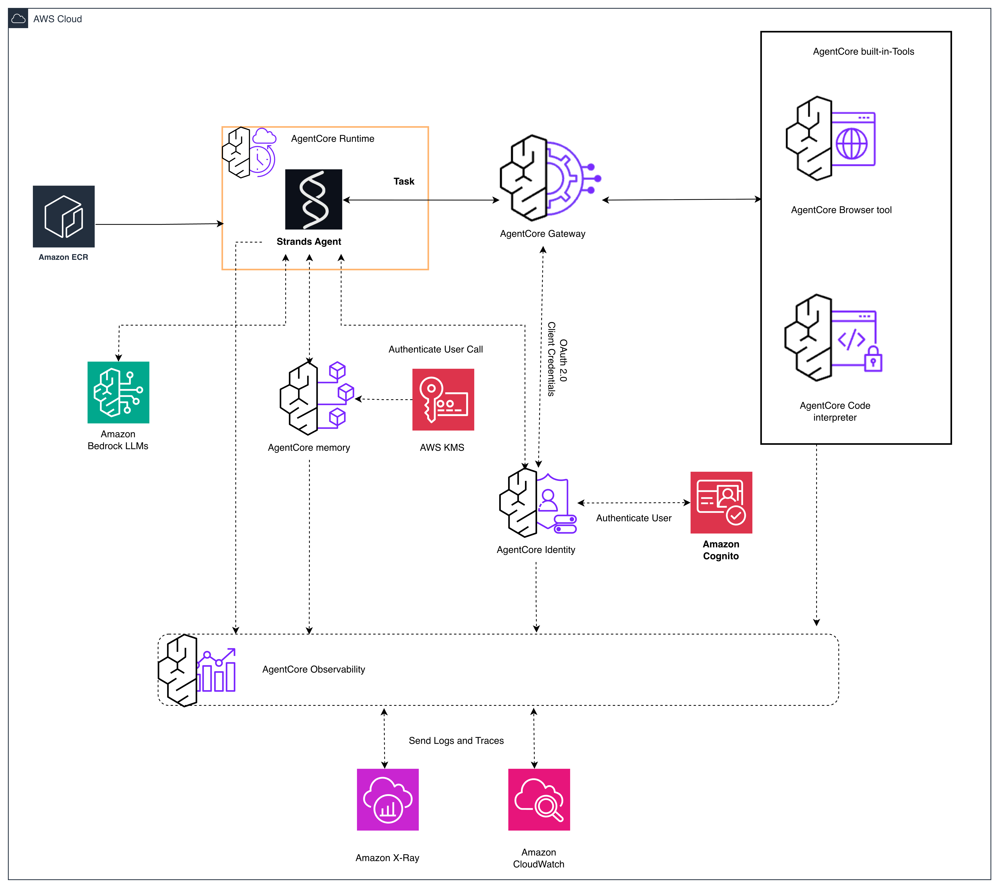

# AgentCore DevOps Solution

Complete end-to-end solution for deploying agentic AI applications using Amazon Bedrock AgentCore with Terraform IaC and automated CI/CD via GitHub Actions.

## Architecture


## Repository Structure

```
├── agent-app/                          # Agentic AI Application
│   ├── src/
│   │   └── agent.py                    # Main agent (Strands + browser-use)
│   ├── tests/
│   │   └── smoke_test.py               # Smoke tests
│   ├── Dockerfile                      # Container (Amazon Linux 2023 ARM64)
│   └── requirements.txt                # Python dependencies
│
├── infrastructure/                     # Terraform Infrastructure
│   ├── modules/                        # Reusable Terraform modules
│   │   ├── agentcore-runtime/          # Agent execution environment
│   │   ├── agentcore-memory/           # Conversation memory
│   │   ├── agentcore-gateway/          # MCP gateway + targets
│   │   ├── agentcore-identity/         # Auth providers
│   │   ├── agentcore-tools/            # Browser & Code Interpreter
│   │   └── agentcore-observability/    # Logging & tracing
│   └── environments/
│       └── dev/                        # Dev environment config
│           ├── main.tf                 # All resources + modules
│           ├── bedrock-guardrails.tf   # Bedrock Guardrail config
│           ├── lambda-functions/       # Gateway Lambda target
│           └── *.tf                    # Variables, outputs, etc.
│
├── .github/workflows/
│   ├── 01-build-agent.yml              # Build & push container to ECR
│   ├── 02-deploy-infra.yml             # Terraform plan/apply
│   ├── 03-update-runtime.yml           # Update runtime version + endpoint
│   └── 04-destroy-infra.yml            # Teardown infrastructure
│
├── scripts/
│   └── setup-foundation.sh             # Foundation setup script
│
├── SECURITY.md                         # Security considerations
└── README.md
```

## Components

### Agent Application
- Built with [Strands Agents SDK](https://github.com/strands-agents/strands-agents) using Claude Sonnet 4 as the primary model
- Browser automation via [browser-use](https://github.com/browser-use/browser-use) with Claude 3.7 Sonnet driving the browser agent
- Integrated with all AgentCore services: Gateway, Memory, Code Interpreter, Browser, Identity
- Containerized on Amazon Linux 2023 (ARM64) with ADOT for observability

### Infrastructure Modules
| Module | Description |
|--------|-------------|
| agentcore-runtime | Agent execution environment with versioned endpoints |
| agentcore-memory | Short-term + long-term memory with User Preference strategy |
| agentcore-gateway | MCP protocol gateway with Lambda target (policy lookup) |
| agentcore-identity | Workload identity provider |
| agentcore-tools | Browser and Code Interpreter tools |
| agentcore-observability | CloudWatch log delivery + X-Ray sampling rules |

### Security
- Bedrock Guardrails (content filtering, PII detection, denied topics, word filters)
- KMS encryption for all sensitive data (logs, secrets, SQS)
- IAM least privilege with scoped policies
- VPC Flow Logs with KMS encryption (optional VPC deployment)
- Lambda code signing
- GitHub Actions OIDC (no long-lived credentials)

### Observability
| Resource | Log Type | Destination |
|----------|----------|-------------|
| Runtime | USAGE_LOGS | CloudWatch Logs |
| Browser | USAGE_LOGS | CloudWatch Logs |
| Code Interpreter | USAGE_LOGS | CloudWatch Logs |
| Memory | APPLICATION_LOGS | CloudWatch Logs |
| Gateway | APPLICATION_LOGS | CloudWatch Logs |

All log groups use 365-day retention with KMS encryption. X-Ray sampling rules are configured for runtime, browser, code interpreter, memory, and gateway resources.

## IAM Permissions

### Agent Execution Role
The agent execution role (`agentcore-{project}-{env}-agent-execution-role`) requires:
- `BedrockAgentCoreFullAccess` managed policy (AgentCore APIs)
- `bedrock:InvokeModel` and `bedrock:InvokeModelWithResponseStream` for Claude Sonnet 4 and Claude 3.7 Sonnet
- `bedrock:ApplyGuardrail` scoped to the guardrail ARN
- `secretsmanager:GetSecretValue` scoped to specific secret paths (`agentcore/config-*`, `agentcore/db-credentials-*`, `agentcore/api-keys-*`)
- `ecr:GetAuthorizationToken` (resource: `*` — AWS requirement)
- `ecr:BatchCheckLayerAvailability`, `ecr:GetDownloadUrlForLayer`, `ecr:BatchGetImage` scoped to `agentcore-*` repositories
- `kms:Decrypt`, `kms:GenerateDataKey`, `kms:DescribeKey` for the AgentCore KMS key

### Gateway Execution Role
- `lambda:InvokeFunction` scoped to the policy lookup Lambda
- KMS permissions for the AgentCore key

## Quick Start

### Prerequisites
- AWS account with Bedrock AgentCore access
- Terraform >= 1.0
- Docker (for building the agent container)
- AWS CLI configured
- GitHub repository with OIDC configured for AWS

### 1. Foundation Setup
```bash
# Run the foundation setup script
./scripts/setup-foundation.sh
```

### 2. Deploy Infrastructure
```bash
cd infrastructure/environments/dev
terraform init
terraform plan
terraform apply
```

### 3. Build and Push Agent Container
```bash
cd agent-app
docker build --platform linux/arm64 -t agentcore-agent:latest .
# Tag and push to ECR (automated via GitHub Actions workflow 01)
```

### 4. Test in Agent Sandbox
Navigate to Amazon Bedrock AgentCore → Test → Agent sandbox in the AWS console.

Sample prompts:
```json
{"prompt": "What is POL-001?"}
{"prompt": "Execute Python code to calculate factorial of 20"}
{"prompt": "What is the temperature of Seattle?"}
{"prompt": "Remember that my favorite color is blue. user_id: testuser1, session_id: session001"}
```

## CI/CD Pipeline

| Workflow | Trigger | Description |
|----------|---------|-------------|
| 01-build-agent | Push to main | Builds Docker image, pushes to ECR |
| 02-deploy-infra | After build | Terraform init/plan/apply |
| 03-update-runtime | After deploy | Creates new runtime version, updates endpoint |
| 04-destroy-infra | Manual | Tears down all infrastructure |

## Testing

### Guardrail Validation
```bash
# Test denied topic (financial advice)
aws bedrock-runtime apply-guardrail \
  --guardrail-identifier <GUARDRAIL_ID> \
  --guardrail-version 1 \
  --source INPUT \
  --content '[{"text": {"text": "Should I invest in stocks?"}}]' \
  --region us-east-1

# Test PII detection
aws bedrock-runtime apply-guardrail \
  --guardrail-identifier <GUARDRAIL_ID> \
  --guardrail-version 1 \
  --source INPUT \
  --content '[{"text": {"text": "My email is test@example.com"}}]' \
  --region us-east-1
```

### Memory Validation
```bash
# Write an event
aws bedrock-agentcore create-event \
  --memory-id <MEMORY_ID> \
  --actor-id "testuser1" \
  --session-id "test-session-001" \
  --event-timestamp "$(date -u +%Y-%m-%dT%H:%M:%SZ)" \
  --payload '[{"conversational": {"content": {"text": "My favorite color is blue"}, "role": "USER"}}]' \
  --region us-east-1

# List events
aws bedrock-agentcore list-events \
  --memory-id <MEMORY_ID> \
  --actor-id "testuser1" \
  --session-id "test-session-001" \
  --include-payloads \
  --region us-east-1
```

### Code Interpreter Validation
```bash
# Start session
aws bedrock-agentcore start-code-interpreter-session \
  --code-interpreter-identifier <CODE_INTERPRETER_ID> \
  --region us-east-1

# Execute code
aws bedrock-agentcore invoke-code-interpreter \
  --code-interpreter-identifier <CODE_INTERPRETER_ID> \
  --session-id <SESSION_ID> \
  --name "executeCode" \
  --arguments '{"code": "print(sum(range(1, 101)))", "language": "python"}' \
  --region us-east-1
```

## Troubleshooting

| Issue | Cause | Fix |
|-------|-------|-----|
| `AccessDeniedException: bedrock:ApplyGuardrail` | Agent role missing guardrail permission | Add `bedrock:ApplyGuardrail` scoped to guardrail ARN |
| `AccessDeniedException: bedrock:InvokeModel` | Agent role missing model invocation permission | Add `bedrock:InvokeModel` for the foundation models used |
| Browser timeout (15 min) | Agent role can't call the LLM that drives browser-use | Add `bedrock:InvokeModel` for Claude 3.7 Sonnet |
| Memory/Gateway log delivery fails with `ValidationException` | Wrong log type for resource | Use `APPLICATION_LOGS` (not `USAGE_LOGS`) for memory and gateway |
| weather.gov returns no results | Non-US city queried | weather.gov only supports US locations |

## Environment Variables (Agent Runtime)

| Variable | Description |
|----------|-------------|
| `BROWSER_ID` | AgentCore Browser tool ID |
| `CODE_INTERPRETER_ID` | AgentCore Code Interpreter tool ID |
| `MEMORY_ID` | AgentCore Memory ID |
| `AWS_REGION` | AWS region |
| `GATEWAY_ID` | AgentCore Gateway ID |
| `GATEWAY_URL` | AgentCore Gateway endpoint URL |
| `WORKLOAD_IDENTITY_NAME` | Workload identity provider name |
| `GUARDRAIL_ID` | Bedrock Guardrail ID |
| `GUARDRAIL_VERSION` | Bedrock Guardrail version |

## Security

See [CONTRIBUTING](CONTRIBUTING.md#security-issue-notifications) for more information.

## License

This library is licensed under the MIT-0 License. See the LICENSE file.

